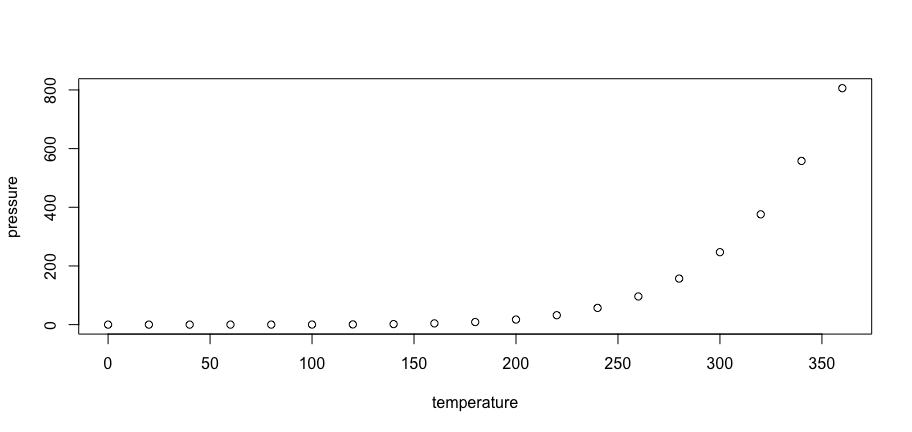

Readme for GDC Exhibitors 2018
================
Evan Kaeding
3/15/2018

Who's Exhibiting at GDC this year?
----------------------------------

I wanted to take a closer look at who was exhibiting at GDC this year, so I decided to take a data-driven approach. Have a look!

### Importing and Downloading Data on the Exhibitors

First, we'll need to start with a list of the exhibitors. Well, not a `list` per se, but at the very least something that we can use to identify each of the companies exhibiting at GDC. Fortunately, the folks at GDC make this readily available at this link [here](%5Bhttp://expo.gdconf.com/2018/exhibitor-list/).

Now, I won't release the code that extracts this informaiton from the webpage for fear of someone using it for malicious intent, but you can imagine the process. At the end, you end up with a single-column `data.frame` holding the URL of 293 companies exhibiting at GDC.

Once we have the `data.frame` containing the URL for each company exhibiting, we'll need to get some more information on these companies. I decided to give **Clearbit's Enrichment API** a try, as I've used their Salesforce and HubSpot integrations before and had some good success. Although I had never interacted with their API before, it was very quick to pick up.

I wrote these two functions to help interact with their API:

``` r
source("get_company_info.R")
source("company_lookup.R")
source("response_cleaner.R")
```

**`get_company_info`** is a wrapper function for Clearbit's Enrichment API. It takes in a single company URL and your Clearbit API key and returns a JSON response containing several details about the company in question. Quite handy!

**`response_cleaner`** is a function that reads in a JSON response, extracts the relevant content from the response and prints the status code of the API response. Now, most web developer will cringe at this implementation, but keep in mind I'm dealing with highly predictable inputs here in a very limited application scope. Never something I'd run in production.

**`company_lookup`** is a looping function that calls both of the previous two functions. It takes in a `data.frame` containing several company URLs and an API key, and saves these responses in the working directory as `.rda` files. It would be advisable to create a new directory to contain these API responses.

``` r
# Set the API key in the global.env

key <- "your-api-key-here"

# Create a directory for your responses and set it as the working directory

dir.create(file.path("responses"))
```

    ## Warning in dir.create(file.path("responses")): 'responses' already exists

``` r
setwd(file.path("./responses"))

# Populate the responses directory with cleaned API responses from Clearbit

#company_lookup(companies = exhibitors, key = key)
```

### Extraction and Enrichment

Now, we have a whole directory full of API responses ready to parse. We'll need to employ some clever `apply` functions to avoid looping through all of these to get the relevant informaiton.

``` r
source("extract_details.R")
source("read_companies.R")
```

**`extract_details`** is designed to parse a company object (represented as a `list` in R) and extract a pre-defined subset of company attributes returned from Clearbit.

**`read_companies`** is designed to read in an entire directory of R objects and store them in a `list`.

We'll use the two functions above in tandem to read all of the API responses into a list, then use `lapply` to extract the relevant details from each one of them.

``` r
# Reset the working directory to our responses

setwd(file.path("./responses-2"))

# Read all of the cleaned API responses into a single list

companies <- read_companies()

# Extract the relevant details from each item in the list and bind the rows as a data.frame

company_details <- do.call(rbind, lapply(companies, extract_details))

# Clean it up a little bit using dplyr

library(dplyr)
```

    ## 
    ## Attaching package: 'dplyr'

    ## The following objects are masked from 'package:stats':
    ## 
    ##     filter, lag

    ## The following objects are masked from 'package:base':
    ## 
    ##     intersect, setdiff, setequal, union

``` r
company_details <- company_details %>%
                mutate(URL = rownames(company_details))
```

R Markdown
----------

This is an R Markdown document. Markdown is a simple formatting syntax for authoring HTML, PDF, and MS Word documents. For more details on using R Markdown see <http://rmarkdown.rstudio.com>.

When you click the **Knit** button a document will be generated that includes both content as well as the output of any embedded R code chunks within the document. You can embed an R code chunk like this:

``` r
summary(cars)
```

    ##      speed           dist       
    ##  Min.   : 4.0   Min.   :  2.00  
    ##  1st Qu.:12.0   1st Qu.: 26.00  
    ##  Median :15.0   Median : 36.00  
    ##  Mean   :15.4   Mean   : 42.98  
    ##  3rd Qu.:19.0   3rd Qu.: 56.00  
    ##  Max.   :25.0   Max.   :120.00

Including Plots
---------------

You can also embed plots, for example:



Note that the `echo = FALSE` parameter was added to the code chunk to prevent printing of the R code that generated the plot.
