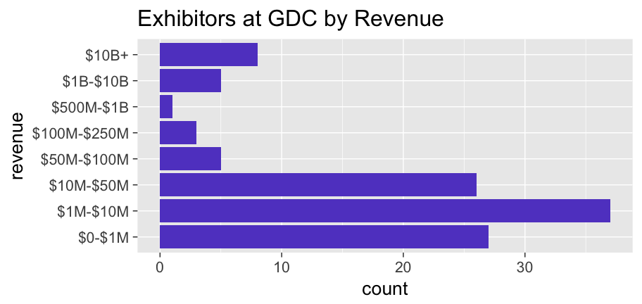
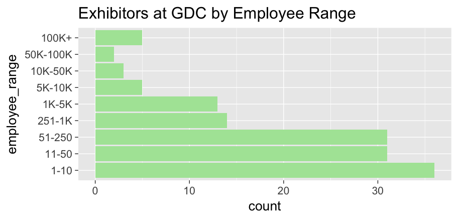
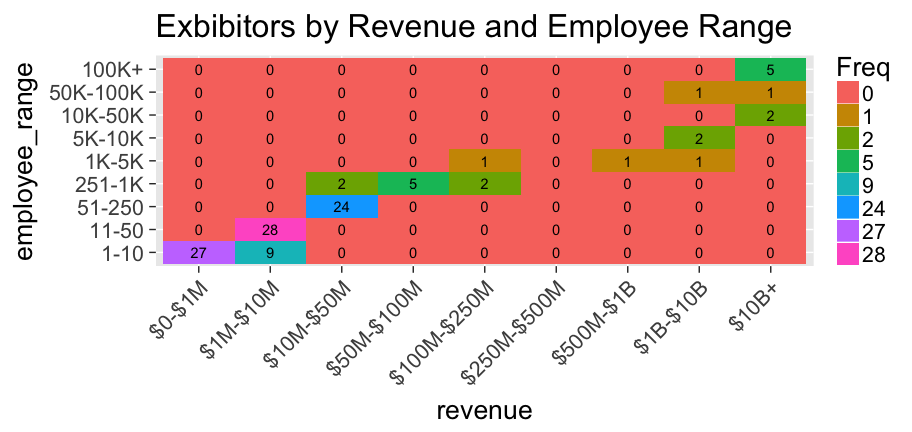
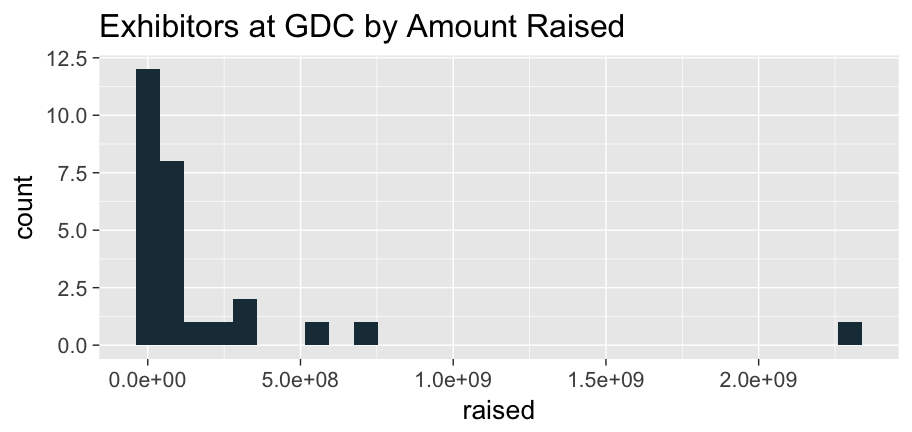
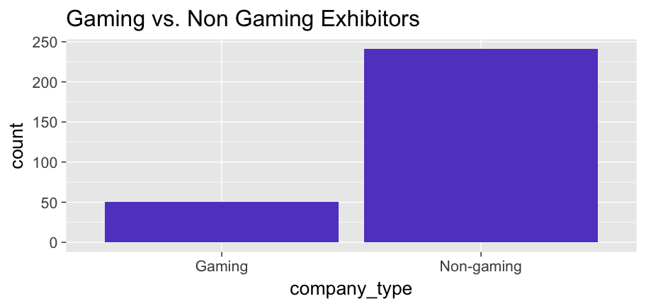
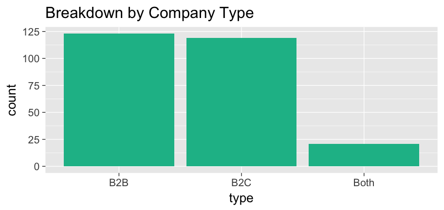

Readme for GDC Exhibitors 2018
================
Evan Kaeding
3/15/2018

Who's Exhibiting at GDC this year?
----------------------------------

I wanted to take a closer look at who was exhibiting at GDC this year, so I decided to take a data-driven approach. Have a look!

### Following Along

I crafted this markdown file so that you can follow along and build the visualizations on your own machine. Simply clone the repository into your local working directory and get started.

Keep in mind that I won't be sharing my Clearbit API key, so if you want to do your own analysis, you'll obviously want to get your own API key. Save it as a character vector as `key.rda` in your working directory. Your first 50 API calls are free, so you'll get about 20% of the data.

If you don't want to make API calls to Clearbit, I recommend just commenting out the code block. I'll alert you as to where that is and what to comment out.

### Importing and Downloading Data on the Exhibitors

First, we'll need to start with a list of the exhibitors. Well, not a `list` per se, but at the very least something that we can use to identify each of the companies exhibiting at GDC. Fortunately, the folks at GDC make this readily available at this link [here](%5Bhttp://expo.gdconf.com/2018/exhibitor-list/).

Now, I won't release the code that extracts this informaiton from the webpage for fear of someone using it for malicious intent, but you can imagine the process. At the end, you end up with a single-column `data.frame` holding the URL of 293 companies exhibiting at GDC.

Once we have the `data.frame` containing the URL for each company exhibiting, we'll need to get some more information on these companies. I decided to give **Clearbit's Enrichment API** a try, as I've used their Salesforce and HubSpot integrations before and had some good success. Although I had never interacted with their API before, it was very quick to pick up.

I wrote these functions to help interact with their API:

``` r
source("get_company_info.R")
source("company_lookup.R")
source("response_cleaner.R")
```

**`get_company_info`** is a wrapper function for Clearbit's Enrichment API. It takes in a single company URL and your Clearbit API key and returns a JSON response containing several details about the company in question. Quite handy!

**`response_cleaner`** is a function that reads in a JSON response, extracts the relevant content from the response and prints the status code of the API response. Now, most web developer will cringe at this implementation, but keep in mind I'm dealing with highly predictable inputs here in a very limited application scope. Never something I'd run in production.

**`company_lookup`** is a looping function that calls both of the previous two functions. It takes in a `data.frame` containing several company URLs and an API key, and saves these responses in the working directory as `.rda` files. It would be advisable to create a new directory to contain these API responses.

``` r
# Load your data.frame of company URLs the API key in the global.env

load(file.path("exhibitors.rda"))
load(file.path("key.rda"))

# Create a directory for your responses and set it as the working directory

dir.create(file.path("responses"))
setwd(file.path("./responses"))

# Populate the responses directory with cleaned API responses from Clearbit

### --- COMMENT THIS OUT IF YOU DON'T WANT TO MAKE YOUR OWN API CALLS --- ###

company_lookup(companies = exhibitors, key = key)
```

### Extraction and Enrichment

Now, we have a whole directory full of API responses ready to parse. We'll need to employ some clever `apply` functions to avoid looping through all of these to get the relevant informaiton.

**Note for those following along**: You can comment out all of the code blocks between here and the visualization section. I've populated the repository with the final, cleaned file called `company-details.rda` that you'll use for visualization.

``` r
source("extract_details.R")
source("read_companies.R")
```

**`extract_details`** is designed to parse a company object (represented as a `list` in R) and extract a pre-defined subset of company attributes returned from Clearbit.

**`read_companies`** is designed to read in an entire directory of R objects and store them in a `list`.

We'll use the two functions above in tandem to read all of the API responses into a list, then use `lapply` to extract the relevant details from each one of them.

``` r
# Reset the working directory to our responses

setwd(file.path("./responses"))

# Read all of the cleaned API responses into a single list

companies <- read_companies()

# Extract the relevant details from each item in the list and bind the rows as a data.frame

company_details <- do.call(rbind, lapply(companies, extract_details))

# Clean it up a little bit using dplyr

library(dplyr, quietly = TRUE)

company_details <- company_details %>%
                mutate(URL = rownames(company_details)) %>%
                mutate(name = as.character(name)) %>%
                mutate(tags = as.character(tags)) %>%
                mutate(employee_range = factor(employee_range, levels(employee_range)[c(6,2,3,7,4,1,8,9,5)], ordered = TRUE)) %>%
                mutate(revenue = factor(revenue, c(levels(revenue), "$250M-$500M")[c(5,2,3,7,6,9,8,1,4)]))
```

### Visualization and Exploration

In creating these visualizations, we'll need to keep in mind that Clearbit does not have complete informaiton for many of these companies. However, we'll operate under the assumption that Clearbit has information on companies that constitute a representative sample of the population.

``` r
kable(data.frame(na.values = sapply(company_details, function(x) sum(is.na(x)))) %>%
        mutate(total = nrow(company_details)) %>%
        mutate(missing_info = paste0(round(100 * na.values/total), "%")) %>%
        mutate(variable = names(company_details)) %>%
        select(variable, na.values, missing_info))
```

| variable           |  na.values| missing\_info |
|:-------------------|----------:|:--------------|
| name               |         47| 16%           |
| tags               |          0| 0%            |
| description        |         61| 21%           |
| country            |        120| 41%           |
| state              |        127| 44%           |
| crunchbase\_handle |        130| 45%           |
| employees          |        151| 52%           |
| employee\_range    |        151| 52%           |
| revenue            |        179| 62%           |
| raised             |        264| 91%           |
| URL                |          0| 0%            |

**Size**

Let's try to get a sense of how big these companies are from both a revenue and employee perspective.

``` r
rev_plot <- company_details %>%
        filter(!is.na(revenue)) %>%
        ggplot(mapping = aes(revenue)) +
        geom_histogram(stat = "count", fill = "#6249CA") +
        coord_flip() +
        ggtitle("Exhibitors at GDC by Revenue")

suppressWarnings(print(rev_plot))
```



Based on this distribution, it appears that the majority of companies here tend to be on the small side. Let's see how that stacks up against employee counts.

``` r
emp_rng_plot <- company_details %>%
        filter(!is.na(employee_range)) %>%
        ggplot(mapping = aes(employee_range)) +
        geom_histogram(stat = "count", fill = "#ADE4A5") +
        coord_flip() +
        ggtitle("Exhibitors at GDC by Employee Range")

suppressWarnings(print(emp_rng_plot))
```



So far so good, as far as I'm concerned, as I tend to like talking to smaller companies. One final look at the intersection between these two is helpful just to ensure that there's nothing askew here.

``` r
tile_plot <- data.frame(table(select(company_details, revenue, employee_range))) %>%
        mutate(Freq = as.factor(Freq)) %>%
        ggplot(mapping = aes(x = revenue, y = employee_range)) +
        geom_tile(aes(fill = Freq)) +
        geom_text(aes(label = Freq)) +
        ggtitle("Exbibitors by Revenue and Employee Range") +
        theme(axis.text.x = element_text(angle = 45, hjust = 1))

print(suppressWarnings(tile_plot))
```



Let's see how many of these companies have raised venture funds. Keep in mind that data here is pretty sparse, which could mean that many of these companies have not raised, or that the data is not available (on Crunchbase for example).

``` r
raised_plot <- company_details %>%
        filter(!is.na(raised)) %>%
        ggplot(mapping = aes(raised)) +
        geom_histogram(fill = "#1B3946") +
        ggtitle("Exhibitors at GDC by Amount Raised")

suppressWarnings(print(raised_plot))   
```



It looks like the majority of VC money here is concentrated toward the bottom of the pile. Of course, it's difficult to say having so few data points here.

Next, let's take a look now at how many companies are specifically in the gaming industry.

``` r
gaming_companies <- company_details %>%
        mutate(company_type = ifelse(grepl("game|games|gaming", tags, ignore.case = TRUE), "Gaming", "Non-gaming")) %>%
        mutate(company_type = factor(company_type)) %>%
        ggplot(mapping = aes(company_type)) +
        geom_histogram(stat = "count", fill = "#6249CA") +
        ggtitle("Gaming vs. Non Gaming Exhibitors")

suppressWarnings(print(gaming_companies))
```



Overall, I would like to see more gaming companies exhibiting here. Perhaps this is a data quality issue, or perhaps the exhibitors are primarily other vendors. To check this, let's move on to the final section.

Finally, I want to take a look at the breakdown between B2B and B2C companies. Let's have a look.

``` r
company_breakdown <- company_details %>%
        mutate(B2B = ifelse(grepl("B2B", tags), 1, 0)) %>%
        mutate(B2C = ifelse(grepl("B2C", tags), 1, 0)) %>%
        mutate(Both = ifelse(B2B == 1 & B2C == 1, 1, 0)) %>%
        gather(key = type, value = value, B2B, B2C, Both) %>%
        group_by(type) %>%
        summarize(count = sum(value)) %>%
        ggplot(mapping = aes(x = type, y = count)) +
        geom_bar(stat = "identity", position = "stack", fill = "#17BB96") +
        ggtitle("Breakdown by Company Type")

suppressWarnings(print(company_breakdown))
```



Conslusions
-----------

Overall, I'm pretty happy with what I found about the exhibitors at GDC. They tend to be smaller companies with a good mix of funding with a reasonable concentration in the gaming industry. For Cooladata, we do best with B2C companies for direct sales and B2B for partnerships, so a healthy mix is always good.

I had some data on location that I didn't use, that doesn't matter too much to me. I suppose it's something I could go back an analyze if need be.

With that said, I'm excited to be going to GDC next week! If you want to meet up, feel free to shoot me an email at <evan@cooladata.com>
